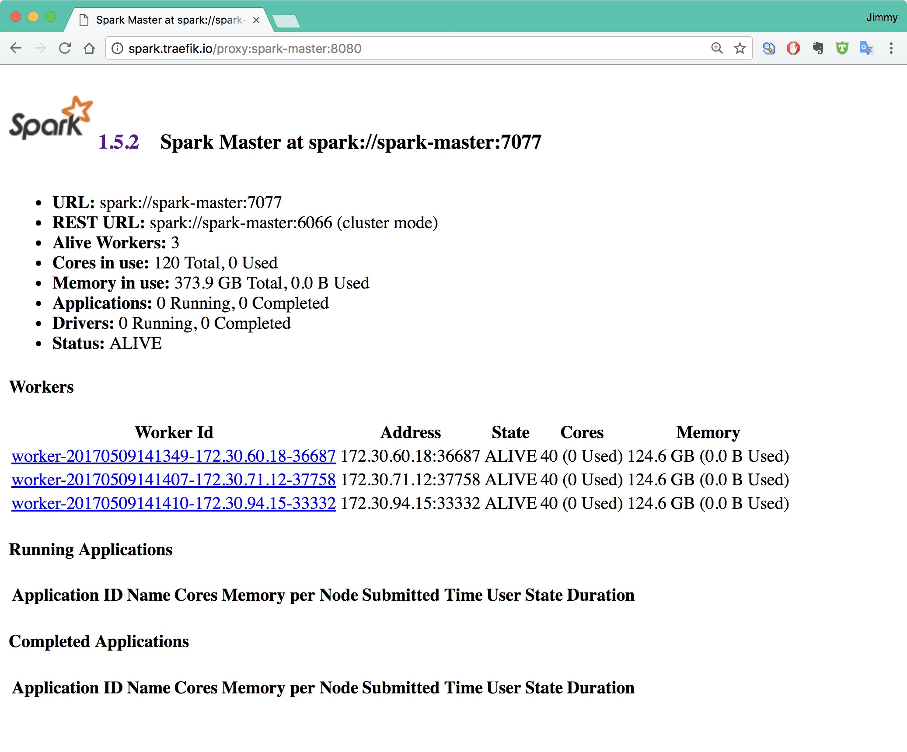
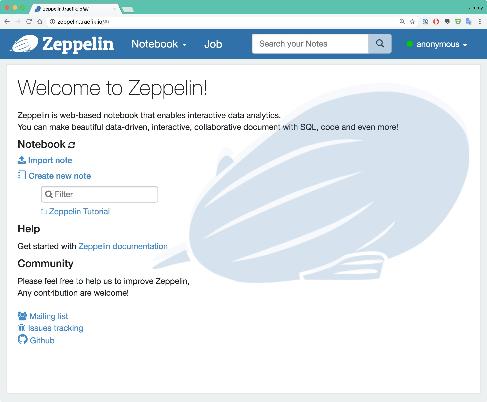

# Spark on Kubernetes

通过容器方式在Kubernetes上运行spark集群。

## 镜像制作

**手动编译**

修改`spark/Makefile`中的`DOCKER_REGISTRY`为你的私有镜像仓库地址。

```bash
$ cd spark
$ make all
$ make push
```

**时速云镜像**

或者直接下载我已经编译好的镜像，上传到了时速云仓库：

```
index.tenxcloud.com/jimmy/spark:1.5.2_v1
index.tenxcloud.com/jimmy/zeppelin:0.7.1
```

## 在Kubernetes上启动spark

创建名为spark-cluster的namespace，所有操作都在该namespace中进行。

所有yaml文件都在`manifests`目录下。

```bash
$ kubectl create -f manifests/
```

将会启动一个拥有三个worker的spark集群和zeppelin。

同时在该namespace中增加ingress配置，将spark的UI和zeppelin页面都暴露出来，可以在集群外部访问。

该ingress后端使用[traefik](htts://traefik.io)。

## 访问spark

通过上面对ingress的配置暴露服务，需要修改本机的/etc/hosts文件，增加以下配置，使其能够解析到上述service。

```
172.20.0.119 zeppelin.traefik.io
172.20.0.119 spark.traefik.io
```

172.20.0.119是我设置的VIP地址，VIP的设置和traefik的配置请查看[kubernetes-handbook](https://github.com/rootsongjc/kubernetes-handbook)。

**spark ui**

访问http://spark.traefik.io



**zeppelin ui**

访问http://zepellin.treafik.io

